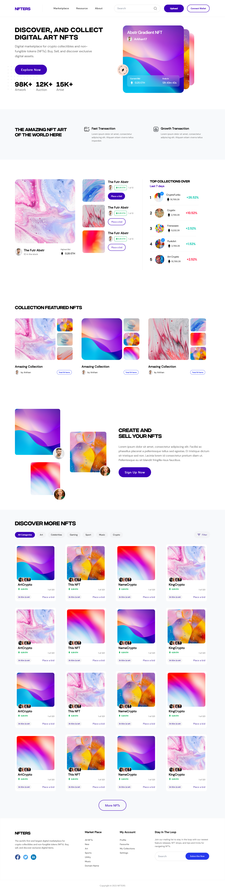

# NFTERS

#### Preview: https://nfters-io.netlify.app/

# Packages Installed

###### Created react app with redux

###### Installed sass (npm i sass --save-dev)

###### Added Bootstrap 5.2.3 (https://getbootstrap.com/docs/5.2/getting-started/introduction/#cdn-links)

###### Installed React Router DOM (npm i react-router-dom)

###### Installed React Helmet (npm i react-helmet)

###### Installed React Icons (npm i react-icons --save)

###### Installed React Fast Marquee (npm i react-fast-marquee --save)

###### Installed Tailwind CSS (https://tailwindcss.com/docs/installation)

###### Installed Swiper (npm i swiper) (https://swiperjs.com/react)

###### Data AOS (npm i aos)

###### Hover.css (npm i hover.css --save)

# Initial Work

###### Deleted unnecessary files & Comments. CSS file renamed as SCSS. React Router added to App.js. Components folder created. Pages folder created. Utils folder created. Layout folder created. Assets folder created. Images folder created inside Assets. Layout folder created & route added to app.js. Header & Footer folder-file created and added to layout file. Home folder-file created and route added to app.js. Meta folder-file created and used in Home file. Data AOS and Hover.css installed.

##### Tech & Tools: React.js, Tailwind CSS, SASS, React Router, Swiper.js, React Icons, Git, Github, Netlify, Data AOS, Hover.css, & Figma.

###### TASK PROJECT
